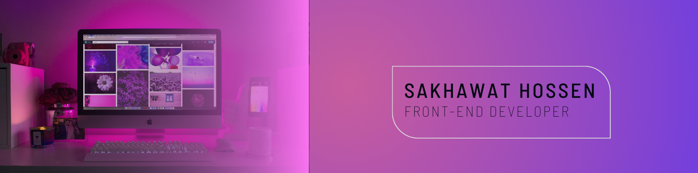

## Hi there 👋

## Sakhawat Hossen

I'm an LL.B student with a strong passion for web development. I'm particularly interested in building user-friendly and visually appealing web applications using the MERN stack (MongoDB,
 Express.js, React.js, and Node.js). JavaScript is my primary programming language, and I leverage component libraries like Tailwind CSS, DaisyUI, and Material Tailwind to streamline development and create beautiful interfaces.
--
## Skils

## Stats

